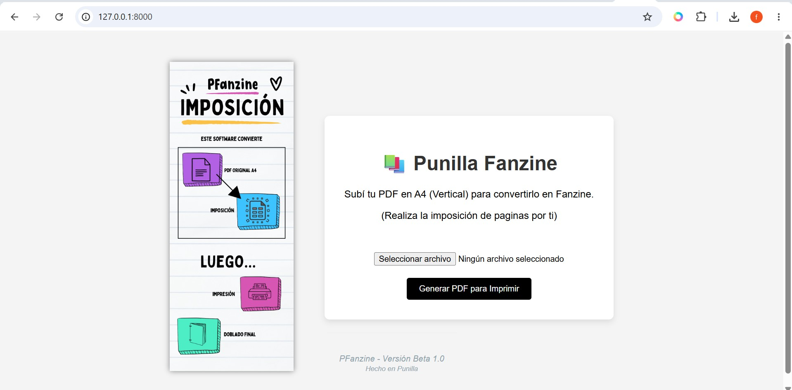

# Pfanzine

Proyecto local basado en Laravel.
Convierte un PDF común en un PDF con imposición de paginas listas para imprimir en formato fanzine/libro



## Descripción


## Requisitos

- PHP 8+
- Composer
- Servidor web (XAMPP, Valet, o `php artisan serve`)

## Instalación rápida

```bash
composer install
cp .env.example .env
php artisan key:generate
php artisan migrate
```

## Ejecutar en desarrollo

```bash
php artisan serve
```

## Portada

La imagen de portada está en la raíz: `portada.jpg` (ruta: `portada.jpg`). Se mostrará en la vista si la aplicación la referencia.